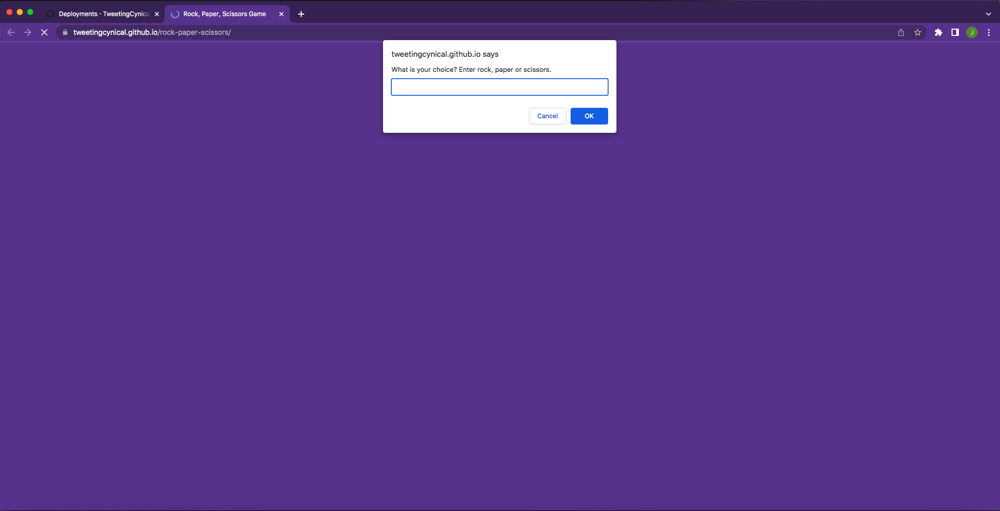

# Rock, Paper, Scissors

## A simple game, interacting with the user via console and alerts

### Deployment / Code Repository

[Live deployment](https://tweetingcynical.github.io/rock-paper-scissors/)

[Repository](https://github.com/TweetingCynical/rock-paper-scissors)

### Scope and Purpose

Build a console game which pits the user against the CPU, for the traditional, best-of-three format.

### Pseudocode

Steps to achieving the working game:

* Declare variables needed for the game:
  - Set user score to 0;
  - Set cpu score to 0;
  - Initialise user and cpu choices with empty string;
  - Initialise array holding the options for the game ['rock', 'paper', 'scissors']
* Choose a random index number from 0, 1 or 2 for CPU choice of option
* Prompt user to make a choice between rock, paper or scissors
* Check the user has made an accurate choice
* Conditionals for user to win: rock beats scissors, scissors beats paper, paper beats rock:
  - if userChoice === cpuChoice, draw round, no score;
  - else if user has a winning position, userScore++;
  - else cpuScore++;
* Check the score, if both players have < 2, repeat the game process (game ends when one player reaches score of 2);
* Display a summary of the score
* Ask if they want to play again or count best of 3. This would require a while loop of game conditions

### Overview of Build

Some of the key JavaScript skills being utilised:
- Use of an array to store the game options;
- Use of Math.floor() and Maths.random() to generate random whole numbers:
    
    cpuChoice = gameOptions[Math.floor(Math.random() * gameOptions.length)];

- While loop to check that the user has chosen a suitable option:

    while (!gameOptions.includes(userChoice)) {userChoice = prompt('Make sure you enter your choice correctly: Enter rock, paper or scissors.').toLowerCase();};

- Use of conditionals to check for user win state;
- Deliberate position of draw state to run first in if conditionals;
- Do, while loop for running the game until one player reaches a score of 2 (best of 3);

## Suggested future changes

- Add images and score board to html so that game becomes based in browser and not through console;
- Add a play again option for user to play a new best of 3 game from the start (possibly keeping a running total of each best of 3 result);

## Screenshot

Working version of site should look like this at standard screen size:

## License

MIT License

Copyright (c) 2022 TweetingCynical

Permission is hereby granted, free of charge, to any person obtaining a copy of this software and associated documentation files (the "Software"), to deal in the Software without restriction, including without limitation the rights to use, copy, modify, merge, publish, distribute, sublicense, and/or sell copies of the Software, and to permit persons to whom the Software is furnished to do so, subject to the following conditions:

The above copyright notice and this permission notice shall be included in all copies or substantial portions of the Software.

THE SOFTWARE IS PROVIDED "AS IS", WITHOUT WARRANTY OF ANY KIND, EXPRESS OR IMPLIED, INCLUDING BUT NOT LIMITED TO THE WARRANTIES OF MERCHANTABILITY, FITNESS FOR A PARTICULAR PURPOSE AND NONINFRINGEMENT. IN NO EVENT SHALL THE AUTHORS OR COPYRIGHT HOLDERS BE LIABLE FOR ANY CLAIM, DAMAGES OR OTHER LIABILITY, WHETHER IN AN ACTION OF CONTRACT, TORT OR OTHERWISE, ARISING FROM, OUT OF OR IN CONNECTION WITH THE SOFTWARE OR THE USE OR OTHER DEALINGS IN THE SOFTWARE.